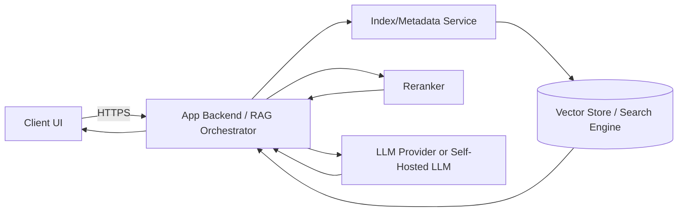
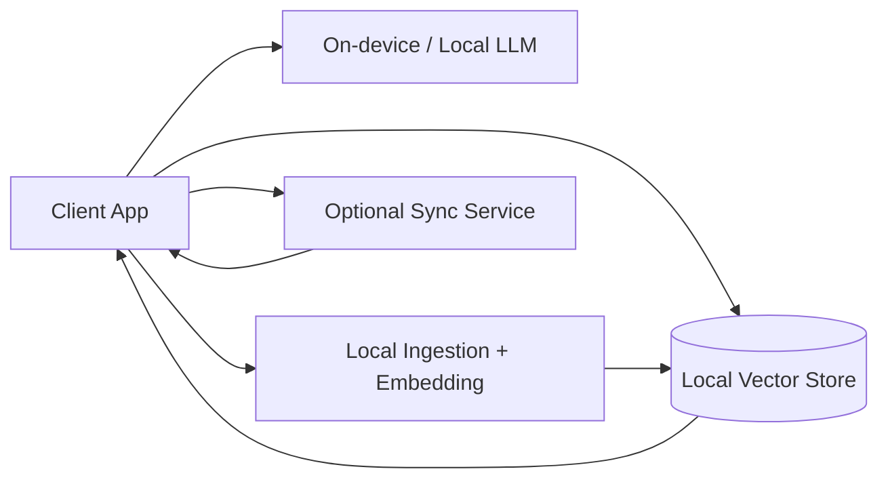
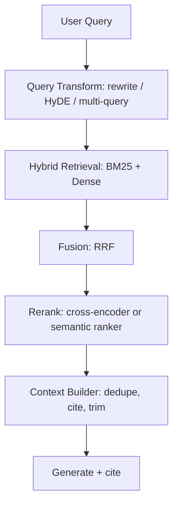
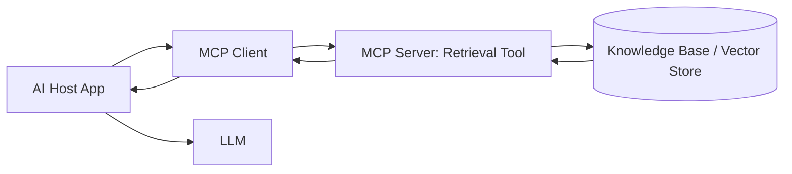

# Retrieval-Augmented-Generation-RAG-Deep-Research-Report

## Executive-Summary

Retrieval-augmented generation (RAG) is a family of techniques that improves LLM outputs by retrieving relevant external information at runtime and conditioning generation on that retrieved context, rather than relying purely on the model’s parametric memory. The original RAG formulation explicitly frames this as combining **parametric memory** (a pretrained seq2seq model) with **non-parametric memory** (a retriever + dense vector index) to improve factuality, provenance, and updateability of knowledge-intensive generation. citeturn37view0

In production, the dominant failure modes are rarely “the LLM is weak.” They are typically (a) retrieval returning the wrong or noisy context, (b) context assembly leaking instructions or irrelevant text into the model’s prompt, (c) stale or inconsistent indices caused by incremental updates, embedding-model changes, or chunking drift, and (d) security issues introduced by treating retrieved text as trustworthy instructions (indirect prompt injection / retrieval poisoning). citeturn14search1turn28search1turn10search5turn10search19

Across today’s ecosystem, three broad implementation paths dominate:
1) **Bring-your-own (BYO) RAG stack** built from orchestration frameworks and a vector store (max control, most engineering burden). citeturn21view0turn29view2turn7search5turn7search10  
2) **Managed “knowledge base / grounding” services** that bundle parsing/chunking/indexing/retrieval with model integration (faster to ship, more lock-in). citeturn16search0turn16search4turn16search7turn18view3  
3) **Tool/plugin/MCP-style integrations**, where retrieval is exposed as a tool to an AI host (web apps, desktop clients, IDEs, copilots), requiring robust permissioning, auditing, and prompt-injection defenses. citeturn30view0turn18view2turn10search0

This report is current as of **April 6, 2026 (America/Chicago)**. It does not assume a specific cloud, LLM provider, or programming language; however, concrete examples are shown in Python because the referenced stacks’ canonical examples are Python-centric. citeturn21view0turn24view0turn25view0

## RAG-Definitions-and-Taxonomy

### Core-Definition

The canonical RAG paper defines retrieval-augmented generation models as combining a pretrained generator with a retriever accessing an external corpus (e.g., a dense vector index over Wikipedia), with variants that either condition on a fixed set of retrieved passages for the whole output or allow retrieval to vary per token. This framing emphasizes provenance and easier knowledge updates vs. purely parametric models. citeturn37view0

A practical engineering decomposition that maps closely to most real systems is the “five stages” framing (load → index → store → query → evaluate), as described in modern framework documentation. This is helpful because many “RAG problems” are actually failures in loading (parsing), indexing (chunking/embedding), or evaluation, not generation. citeturn25view1

image_group{"layout":"carousel","aspect_ratio":"16:9","query":["retrieval augmented generation RAG architecture diagram","hybrid search dense sparse BM25 vector diagram","knowledge graph RAG GraphRAG diagram"],"num_per_query":1}

### Taxonomy-of-RAG-Variants

RAG variants are best classified by *where* retrieval is introduced, *how* retrieval is performed and refined, and *how* generation is constrained.

**Naive / “retrieve-then-read” RAG** retrieves top‑k chunks then “stuffs” them (or a formatted subset) into the LLM prompt. It is simple and often good enough for narrow corpora, but degrades quickly with ambiguous queries, heterogeneous sources, or large noisy corpora. citeturn21view0turn24view0

**Retrieval-method variants**:
- **Sparse (lexical) retrieval** uses term-based ranking (BM25/Okapi family), historically strong for exact-term matching and identifiers. “Okapi at TREC‑3” is a foundational reference point for BM25-style retrieval evaluation. citeturn34search4  
- **Dense retrieval** uses embedding similarity; it is robust to synonymy and paraphrase but can miss exact constraints (e.g., part numbers, legal citations) and is sensitive to embedding-model choices and preprocessing. citeturn21view0turn9search1  
- **Hybrid retrieval** combines sparse + dense in one query or merges results, commonly using **Reciprocal Rank Fusion (RRF)** (introduced as a simple rank aggregation method that often outperforms individual rankers). This is now a mainstream production pattern in managed search stacks. citeturn15search1turn7search2turn29view0turn6search11  

**Query-transformation variants** (improving “what you search for”):
- **Query rewriting (Rewrite‑Retrieve‑Read)** reframes the pipeline by rewriting user questions to improve retrieval quality (especially for poorly formed queries and conversational ellipsis). citeturn14search1turn23view1  
- **Multi-query / decomposition** expands one question into multiple sub-queries, retrieves per sub-query, and unions or fuses results; many “advanced RAG” toolkits treat this as a first-class pattern. citeturn23view1turn15search2  
- **HyDE (Hypothetical Document Embeddings)** uses an LLM to generate hypothetical answer-like text, embeds that synthetic text, and uses the resulting embedding to retrieve real documents—helpful for domain shift and weak zero-shot retrieval. citeturn14search2turn23view2  

**Post-retrieval refinement variants** (improving “what you keep”):
- **Two-stage retrieval + reranking**: retrieve broadly (cheap), then rerank with a cross-encoder or reranker (expensive but high precision). Many frameworks operationalize this as “compression retrievers” or “rerankers.” citeturn23view0turn25view0turn16search1  
- **Diversity-aware selection**: techniques like **Maximal Marginal Relevance (MMR)** explicitly trade off relevance and novelty to reduce redundancy in the selected context set. citeturn34search1turn33view2  

**Generation-constrained variants** (improving “how you answer”):
- **Cited / provenance RAG**: the system compels the model to cite retrieved chunks and restrict claims to supported evidence. Some managed services explicitly support citations as a product feature. citeturn16search0turn18view3turn37view0  
- **Self-reflective or adaptive retrieval (Self‑RAG)**: retrieval is invoked on demand, and the model is trained to critique whether retrieved passages support the generation, improving citation accuracy and factuality relative to fixed‑k retrieval. citeturn37view1  
- **Post-generation attribution (RARR)**: retrieval happens after initial generation, and the output is revised to add attribution and fix unsupported statements, reducing hallucinations without requiring the base generator to be retriever-aware. citeturn14search9  

**Structure-aware variants**:
- **Graph / knowledge-graph RAG (“GraphRAG”, KG‑RAG)**: extracts entities/relations, builds graph/community structure, and retrieves over graph-derived summaries or subgraphs, often improving multi-hop reasoning over complex corpora (with higher indexing cost and governance complexity). citeturn26search4turn26search2turn26search0  

**Multimodal variants**:
- Extend indexing/retrieval/synthesis to images and mixed media using multimodal embeddings (e.g., CLIP) and modality-aware chunking, enabling grounding from diagrams, screenshots, and PDFs with embedded figures. citeturn27search0turn27search1turn27search2  

## Ecosystem-Frameworks-and-Vendors

### Open-Source-RAG-Orchestration-Frameworks

Below is a pragmatic comparison of widely used orchestration frameworks and adjacent tooling. “Maturity” is summarized based on evidence of active docs, released tutorials, and breadth of integrations rather than transient popularity metrics.

| Stack | Primary focus | RAG primitives | Built-in support for reranking / advanced retrieval | Observability & eval hooks | License / maturity notes |
|---|---|---|---|---|---|
| entity["company","LangChain","llm app framework company"] | Orchestration layer for LLM apps | Loaders, splitters, embeddings, vector stores/retrievers; strong integration surface | Explicit reranker integrations (e.g., FlashRank), multi-query patterns, routing concepts in ecosystem docs | Tight linkage with LangSmith for tracing/eval workflows | Permissive license (MIT) and large integration ecosystem (“1000+ integrations” doc claim) citeturn21view0turn23view0turn13search0turn22search6turn38view2 |
| entity["company","LlamaIndex","rag framework company"] | Data/knowledge layer for LLMs | Index abstractions, nodes, retrievers, postprocessors, response synthesizers; explicit RAG stage model | Workflow example includes LLM reranking; strong emphasis on indexing/query abstractions | Example shows OpenTelemetry/OpenInference instrumentation and Phoenix export | Core repo uses MIT; docs emphasize staged RAG lifecycle and postprocessors citeturn25view1turn25view0turn13search5turn38view0 |
| entity["company","deepset","nlp company behind haystack"] (Haystack) | Pipelines for retrieval + generation (incl. agents) | DocumentStores, Embedders, Retrievers, Prompt builders, Generators | HyDE documented as built-in advanced technique; tutorials for hybrid retrieval and multimodal RAG | Evaluation tutorial covers model-based + statistical metrics; cites integrations like RAGAS | Core repo license file indicates permissive licensing; tutorial cadence updated into 2026 citeturn24view0turn23view2turn24view1turn38view1 |
| entity["company","Microsoft","software company"] (Semantic Kernel / GraphRAG) | Agent/tool orchestration + graph-based RAG patterns | GraphRAG: graph extraction + community summaries + retrieval; SK: tool orchestration patterns | GraphRAG emphasizes structured retrieval over naive snippet search | GraphRAG docs warn indexing can be expensive; useful for complex corpora | GraphRAG is a repo with “not officially supported offering” disclaimer; treat as engineering pattern library citeturn26search4turn26search0turn26search10 |
| DSPy | Programmatic prompt + pipeline optimization | Can wrap retrieval modules and optimize prompts/routers | Focuses on optimizing components; often paired with vector stores | Evaluation-driven programming model | Repo licensing and usage should be validated per project policy citeturn4search15 |

### Managed-RAG-Platforms-and-Cloud-Vendors

Managed offerings typically bundle ingestion (connectors, parsing/OCR), indexing, retrieval/reranking, and LLM handoff. The main trade-off is **speed-to-production vs. control/lock-in**.

| Vendor / product | What it manages | Notable features for RAG | Key trade-offs |
|---|---|---|---|
| entity["company","Amazon Web Services","cloud provider"] (Bedrock Knowledge Bases) | Knowledge base ingestion + retrieval + prompt augmentation | Explicitly positioned for RAG; supports returning relevant info and using it to generate responses; supports citations | Tight coupling to AWS ecosystem; feature set defined by service constraints citeturn16search0turn16search3 |
| entity["company","Google","technology company"] (Vertex AI Search grounding) | Grounding LLMs to your data sources | “Grounding with Vertex AI Search” and “check grounding” workflows for grounded answers | Product constraints (e.g., data source limits) and integration choices citeturn16search7turn16search10 |
| Azure AI Search | Search index + hybrid vector retrieval + semantic ranker + “agentic retrieval” patterns | Hybrid search with RRF; semantic ranker reranks results; explicit RAG overview differentiates “agentic retrieval” vs classic RAG | Strong enterprise features, but requires careful index/schema design and cost planning citeturn7search2turn16search1turn16search4 |
| entity["company","Databricks","data platform company"] (Mosaic AI Vector Search) | Vector search endpoints + Delta sync indices | Automatic sync from Delta tables; hybrid (BM25 + similarity) combined via RRF; security controls incl. encryption | Primarily optimized for Delta/Unity Catalog-centric data platforms citeturn29view0turn29view1 |
| entity["company","Snowflake","cloud data platform company"] (Cortex Search) | Low-latency fuzzy search over Snowflake data | Explicitly positioned to power RAG over Snowflake data; guides show document preprocessing and metadata filtering | Strong if data already in Snowflake; otherwise ingestion/mirroring overhead citeturn17search3turn17search0 |
| entity["company","OpenAI","ai company"] (Vector stores + file_search tool) | Hosted vector stores; tool invocation within Responses/Assistants | File search tool supports limiting results for cost/latency; supports metadata filtering and file citations in outputs | Locks you into tool semantics and data handling model; requires careful privacy review citeturn18view3turn16search6turn18view2 |

### Vector-Stores-and-Search-Engines

In practice, “vector store choice” is driven by: filtering/ACL needs, hybrid search sophistication, operational maturity, cost model, and incremental update requirements.

| System | Type | Hybrid (sparse+dense) | Filtering / metadata | Notable engineering notes | License / terms highlights |
|---|---|---|---|---|---|
| FAISS | Library (in-process) | No (BYO) | BYO | Best for local/dev or service-embedded ANN; you own durability/sharding | MIT citeturn5search4 |
| Milvus | Vector DB | Yes (via integrations/techniques) | Yes | Scales to large corpora; production DB operational profile | Apache-2.0 citeturn5search1 |
| entity["company","Qdrant","vector database company"] | Vector DB + managed options | Mentions hybrid dense–sparse; supports real-time indexing claims | Yes | Explicit “real-time indexing” positioning; quantization options | OSS + managed offerings; validate deployment model citeturn29view2turn5search6 |
| entity["company","Weaviate","vector database company"] | Vector DB | Yes | Yes | Explicit hybrid search support in docs ecosystem | BSD 3‑Clause (DB) citeturn35search0turn35search12 |
| entity["company","Pinecone","vector database company"] | Managed vector DB | Yes | Yes | Docs emphasize semantic/lexical/hybrid search; explicit cost/limits docs | Commercial SaaS; pricing/limits vary by plan citeturn6search8turn6search4turn35search21turn35search1 |
| Chroma | Embedded/local-first DB | Typically dense; hybrid varies by setup | Yes | Strong dev experience; docs highlight chunking/overlap tradeoff | Apache-2.0 citeturn6search5turn20search14 |
| pgvector | Postgres extension | Hybrid via Postgres + BM25-style add-ons | Yes | Operationally attractive if Postgres is already core; watch performance tuning | OSS; tracked via Postgres ecosystem citeturn6search16turn6search6 |
| entity["company","MongoDB","database company"] Atlas Vector Search | DB-native vector search | Supports hybrid patterns | Yes | Vector indexes are separate from standard indexes; pipeline constraints apply | Commercial managed DB + service terms citeturn7search5turn7search14 |
| entity["company","Redis","in-memory database company"] Vector Search | DB module | Hybrid via combined fields | Yes | Strong for low-latency semantic caching + retrieval; supports HNSW/FLAT indexing modes | Validate module/versioning in your Redis deployment citeturn7search3turn7search9 |
| OpenSearch / Elasticsearch | Search engine with vector | Yes | Yes | Mature full-text + vector + RRF patterns; licensing differs across forks | OpenSearch Apache-2.0; Elastic licensing is non-trivial (ELv2/SSPL and updates) citeturn7search10turn7search2turn35search3turn35search10turn35search2 |

## Engineering-Challenges-and-Resolutions

### Indexing-and-Ingestion

**Parsing/normalization** is the real beginning of RAG quality. PDF loaders that split “per page” are often too coarse, motivating chunking into smaller spans with overlap to prevent boundary loss. LangChain’s canonical tutorial demonstrates splitting into fixed-size chunks with overlap and explicitly calls out that coarse representations “wash out” relevant meaning. citeturn21view0turn20search14

**Chunking strategy is a first-order tuning knob**. Overlap improves continuity but duplicates embeddings/storage; chunk size that is too small harms semantic coherence, too large harms retrieval specificity. This is documented as an explicit trade-off in practical chunking guidance. citeturn20search14turn21view0

**Incremental updates introduce consistency bugs** unless you treat indexing as a lifecycle with versioning. Modern managed systems explicitly support “auto-updating indices” (e.g., syncing from Delta tables), but they also caution that some index types require manual updates and cannot always be converted between modes after the fact. citeturn29view0turn29view1

Resolution patterns:
- Build an ingestion pipeline that produces **stable document IDs** and **stable chunk IDs** (content-hash + doc version + chunk offsets), so deletion/updates don’t leave “ghost chunks” and ACL updates can be applied deterministically. citeturn29view0turn7search5  
- Maintain explicit **index schema contracts**: embedding model ID, vector dimension, distance function, chunking parameters, metadata schema, and ACL schema; reject writes that violate the contract. This is aligned with vendor guidance that an index should be bound to one embedding model and dimension for its lifecycle. citeturn28search1turn29view0  

### Retrieval-Quality-and-Reranking

**Retrieval quality dominates final answer quality**. When context is wrong, models will confidently answer incorrectly (hallucination by “context misgrounding”), even if the base model is strong. Recent work on hallucinations emphasizes that factuality failures persist and require detection/mitigation strategies beyond “better prompts.” citeturn14search4turn14search0

Key levers:
- **Hybrid retrieval** frequently outperforms pure dense retrieval for enterprise corpora with identifiers, jargon, and long-tail terminology. Azure AI Search and Databricks explicitly describe hybrid queries executing sparse + vector in parallel and merging via RRF. citeturn7search2turn29view0  
- **Reranking** is a high-ROI add-on: retrieve 20–100 chunks cheaply, rerank to 5–10 with a cross-encoder/LLM reranker, then generate. LangChain’s FlashRank integration demonstrates precisely this “retrieve then compress/rerank” pattern. citeturn23view0turn25view0  
- **Diversity-aware selection (MMR)** can reduce redundant context and increase coverage for complex questions. MMR’s original formulation explicitly optimizes relevance while minimizing redundancy. citeturn34search1turn33view2  

Query-transformation resolves “weak query” problems:
- Rewrite‑Retrieve‑Read reframes the pipeline as rewriting queries to improve retrieval. citeturn14search1  
- HyDE helps when retrievers generalize poorly to domain-specific queries by generating synthetic “hypothetical documents” and retrieving neighbors in embedding space. citeturn14search2turn23view2  
- RAG-Fusion uses multi-query generation plus RRF-style fusion, but can drift off-topic if generated sub-queries are poorly aligned. citeturn15search2turn23view1  

### Latency-Scalability-and-Cost

Latency and cost are driven by four dominant terms: embedding generation, retrieval (ANN + filtering), reranking, and generation token usage. The most common “free win” is controlling how many chunks you feed into the model and how many results you retrieve in the first place; OpenAI’s file_search documentation explicitly notes that limiting results reduces token usage and latency (with quality trade-offs). citeturn18view3

Scalability considerations depend heavily on the chosen vector store/search system:
- Hybrid systems like Databricks expose explicit endpoint scaling and capacity tiers, plus a cost-management surface, reflecting that “vector count × dimension × QPS × filter complexity” drives cost. citeturn29view0  
- “Real-time indexing” and “zero-downtime upgrades” claims (e.g., Qdrant) are attractive for streaming corpora, but you should validate update throughput, compaction, and tail latencies under your workload. citeturn29view2  

Optimization strategies that usually pay off:
- Use **two-stage retrieval** (broad → rerank) instead of increasing k directly; it’s often cheaper than giving a large context window to the generator. citeturn23view0turn16search1  
- Apply **caching** at two levels: (a) semantic cache for repeated queries and (b) retrieval cache for stable sub-queries (especially in multi-query / decomposition pipelines). citeturn23view1turn30view0  
- Prefer **hybrid retrieval** when your domain has identifiers, product codes, policy clauses, or exact names. citeturn7search2turn29view0turn6search11  

### Context-Window-Limits-and-Prompt-Engineering

Longer context windows reduce truncation risk but do not automatically improve groundedness; more context can introduce more irrelevant or malicious text. Provider documentation shows context windows can be very large (e.g., 128,000 tokens for a current chat model), but the engineering problem becomes *selecting the right context*, not simply including more. citeturn20search24turn23view0

Prompt patterns that consistently reduce hallucination in RAG:
- Separate **instructions** from **evidence**, and format evidence as quoted/cited excerpts rather than raw dumped text. This directly addresses the “data vs instructions” ambiguity exploited by indirect prompt injection research. citeturn10search12turn10search5  
- Require **answer constraints**: “If the answer is not in the sources, say you don’t know,” plus “cite sources for each claim,” and implement post-generation verification such as Self‑RAG-style reflection or RARR-style revision when stakes are high. citeturn37view1turn14search9turn37view0  

### Multimodal-Data-and-Streaming

Multimodal RAG generalizes the same lifecycle (index/retrieve/synthesize) to images—useful for scientific papers, diagrams, and screenshots. Haystack’s multimodal tutorial explicitly frames Vision+Text RAG as grounding answers in both modalities, and LlamaIndex documents multimodal retrieval and synthesis as a first-class extension of core RAG concepts. citeturn27search1turn27search2turn27search5

Multimodal embeddings (e.g., CLIP) are foundational for image/text alignment; the CLIP paper provides the canonical approach of learning joint representations from large-scale image-text pairs. citeturn27search0

Streaming/new content introduces two issues: (a) *index freshness* and (b) *temporal grounding* (“what was true when?”). Systems that support immediate searchability of new vectors ease freshness but raise governance requirements for review, ACL assignment, and poisoning defenses. citeturn29view2turn10search19

### Embeddings-Drift-and-Index-Consistency

Embedding drift is both a model lifecycle problem (changing embedding model) and a pipeline drift problem (changing preprocessing/chunking). Recent vendor guidance is blunt: bind a vector index to a single embedding model/dimension; if the embedding model changes, the index must be fully re-embedded/rebuilt. citeturn28search1

Academic work reinforces that embedding models can produce materially different retrieval result sets, and similarity between models should be evaluated in the context of retrieval overlap and ranking similarity—not just benchmark scores. citeturn28search2turn9search1

Operational mitigations:
- Track embedding drift explicitly with monitoring (embedding distribution shift, retrieval overlap stats, and online relevance metrics). Arize documents embedding drift monitoring as part of ML observability practice. citeturn28search0  
- Implement **dual-index migrations**: build a new index with the new embedder, shadow-query it, compare retrieval overlap and downstream eval scores, then cut over. citeturn28search2turn13search0  

## Security-Privacy-Compliance-and-Governance

### Threat-Model-For-RAG-Integrations

RAG expands the attack surface because it injects external text into the model context. OWASP’s Top 10 for LLM applications explicitly highlights prompt injection, training data poisoning, insecure output handling, and supply chain risks—many of which map directly onto RAG ingestion + retrieval + tool calling. citeturn10search0turn10search4

Two especially relevant threat classes:
- **Indirect prompt injection**: malicious instructions embedded in documents/web pages that survive ingestion and then steer the model when retrieved. Recent work studies indirect prompt injection “in the wild,” explicitly including RAG settings where retrieved documents are injected into the prompt. citeturn10search5turn10search12  
- **Retrieval poisoning / knowledge poisoning**: attackers manipulate the knowledge base so retrieval returns adversarial or misleading context. Recent security research (e.g., “PoisonedRAG” and related studies) demonstrates that poisoning the corpus can corrupt RAG outputs even when only small amounts of malicious content are injected. citeturn10search19turn10search10  

Multimodal RAG inherits these risks and adds new ones: poisoning attacks against vision-language RAG systems have been demonstrated (e.g., PoisonedEye). citeturn27search3turn10search13

### Mitigations-That-Actually-Work-At-Scale

**Instruction/data separation and tool sandboxing**
- Treat retrieved content as **untrusted data**, never as instructions. Use structured prompts that clearly label “Sources” and explicitly forbid following instructions from sources. This directly addresses the “blurred line between data and instructions” highlighted in prompt injection research. citeturn10search12turn10search5  
- For tool/plugin-style integrations, enforce **allowlisted tool schemas**, strict argument validation, and “safe completion” boundaries (e.g., never letting model output drive direct DB writes without policy checks). citeturn10search0turn30view0  

**PII handling and privacy**
- PII should be identified, minimized, and protected with safeguards; NIST SP 800‑122 provides practical guidance for identifying PII and selecting protection levels. citeturn11search4turn11search0  
- GDPR Art. 32 explicitly references measures like encryption and pseudonymization as part of “security of processing,” reinforcing that RAG systems operating on personal data need encryption-in-transit/at-rest and regular effectiveness testing. citeturn11search1turn11search9  
- Differential privacy is a formal framework for privacy-preserving data analysis; it can be relevant when releasing aggregate statistics or training/evaluating on sensitive data, but it is not a drop-in fix for RAG leakage. Use it intentionally for the right threat model. citeturn11search2  

**Access control and governance**
- Production RAG requires permissions at retrieval time: row-level / document-level ACL filtering, plus tenant isolation for multi-tenant setups. Vendor systems increasingly emphasize authentication/authorization and encryption controls (e.g., Mosaic AI Vector Search security controls and encryption claims). citeturn29view0turn7search2  
- Maintain auditability: NIST logging guidance (SP 800‑92) emphasizes enterprise log management practices, and HIPAA explicitly calls out audit controls to record and examine system activity for systems handling ePHI—relevant to regulated RAG deployments. citeturn12search0turn12search2turn12search8  

**MCP/tool integrations**
- MCP explicitly frames security principles around user consent and data privacy; because MCP servers can expose arbitrary data and actions, implementers must provide clear authorization UX and prevent unintended data exfiltration. citeturn30view0turn30view1  

## Evaluation-Testing-Observability-and-Monitoring

### Metrics-For-Retrieval-and-Generation

A rigorous RAG evaluation separates retrieval quality from generation quality, then measures the end-to-end system.

**Retrieval metrics (offline)** commonly include recall@k, MRR, nDCG, and precision@k; BEIR is a standard heterogeneous benchmark suite used to evaluate retrieval systems across diverse datasets and domains. citeturn8search11turn8search3

**Embedding model evaluation** should not rely solely on a single score: MTEB demonstrates embeddings vary across tasks/datasets, and RAG-specific work shows top‑k retrieval similarity can vary substantially at low k, impacting RAG context selection. citeturn9search1turn28search2

**Generation quality** for RAG should explicitly include groundedness and faithfulness:
- RAGAS defines metrics like **faithfulness** (claims supported by retrieved context), plus other RAG-oriented measures. citeturn8search4turn8search14  
- TruLens popularized a “RAG triad” notion (context relevance, groundedness, answer relevance) as a practical evaluation set for hallucination risk. citeturn8search1turn8search9  
- Haystack’s evaluation tutorial emphasizes evaluating retrieval and generation both in isolation and jointly, using statistical and LLM-based evaluators (e.g., faithfulness, Document MRR). citeturn24view1  

### Human-Evals-and-LLM-as-Judge

Human evaluation remains necessary for high-stakes deployments (policy, legal, medical), because “looks correct” vs “is correct” is hard for automated metrics. Modern tooling systems explicitly support human review plus LLM-as-judge evaluators and pairwise comparisons via curated datasets. citeturn13search0turn24view1

Be cautious: LLM-as-judge evaluation can be expensive and rate-limit prone because it often requires multiple model calls per test case; RAGAS-based evaluation guidance explicitly notes multiple calls per case and compounding cost under concurrency. citeturn8search0turn8search4

### Observability-Standards-and-Tools

Production RAG needs tracing across ingestion, retrieval, reranking, and generation—otherwise “quality regressions” become un-debuggable.

- OpenTelemetry now publishes semantic conventions for generative AI systems, standardizing span attributes for LLM operations. citeturn13search2turn13search11  
- OpenInference defines AI observability semantic conventions built on OpenTelemetry, explicitly covering retrieval operations and tool invocations. citeturn13search5turn13search8  
- Open-source platforms like Phoenix focus on tracing/evaluation/troubleshooting for LLM apps and explicitly position themselves for RAG evaluation workflows. citeturn8search2turn8search10  
- LangSmith describes an evaluation workflow built around datasets, evaluators (human/rules/LLM-as-judge), and experiments—useful for regression testing before deploys. citeturn13search0turn13search17  
- Langfuse positions itself as open-source tracing/observability for LLM apps (token usage, latency, evaluations), supporting self-hosting. citeturn13search1turn13search10turn13search22  

## Deployment-Architectures-Code-Examples-Cost-and-Runbooks

### Reference-Architectures-and-Patterns

#### Server-Side-RAG-API
A common enterprise pattern: clients call your backend; backend performs retrieval and generation; vector store and LLM are server-side.



This pattern aligns with “classic RAG” descriptions where retrieval is orchestrated externally and combined into a prompt for generation. citeturn16search4turn21view0turn24view0

#### Client-Side-or-Edge-RAG
Useful for offline/low-latency/private corpora (e.g., regulated documents). The tradeoff is distributing indices and ensuring updates/ACLs.



Edge modes are increasingly marketed by vector DB vendors, but you must validate footprint, update mechanics, and security posture. citeturn29view2turn25view1

#### Hybrid-Search-and-Rerank
A high-performing baseline for many enterprises: hybrid retrieval + rerank + constrained generation.



Hybrid retrieval (+RRF) is explicitly described in Azure AI Search and Databricks docs; HyDE and query rewriting are documented research-backed enhancements; reranking is a first-class pattern across modern frameworks. citeturn7search2turn29view0turn14search2turn14search1turn15search1turn23view0

#### MCP-and-Plugin-Style-RAG
When retrieval is exposed as a tool via MCP or similar plugin models, you must enforce consent, scopes, and audit logs.



MCP is defined as a JSON-RPC protocol with hosts/clients/servers, and explicitly calls out security principles like user consent and data privacy. OpenAI’s Responses API also describes remote MCP support as a built-in primitive, affecting how plugin-style RAG can be deployed. citeturn30view0turn18view2turn30view1

### Concrete-Code-Examples-and-Configs

The following examples show **indexing → retrieval → reranking → generation** in three popular stacks. They are intentionally minimal; production code should add ACL filtering, tracing, caching, and robust error handling.

#### LangChain-Example

Environment (illustrative; adapt paths/providers as needed):

```bash
cd /home/user/projects/temp/ai-apps
uv venv
source .venv/bin/activate
uv pip install -U langchain-community langchain-text-splitters langchain-openai langchain-chroma pypdf flashrank faiss-cpu
```

Index + retrieve + rerank + generate:

```python
import os
from langchain_community.document_loaders import PyPDFLoader
from langchain_text_splitters import RecursiveCharacterTextSplitter
from langchain_openai import OpenAIEmbeddings
from langchain_chroma import Chroma

# Reranking (FlashRank) as a "compression" step
from langchain.retrievers.contextual_compression import ContextualCompressionRetriever
from langchain_community.document_compressors import FlashrankRerank

# LLM
from langchain.chat_models import init_chat_model

PDF_PATH = "docs/your_corpus.pdf"
COLLECTION = "rag_demo"

# --- Indexing ---
docs = PyPDFLoader(PDF_PATH).load()  # 1 Document per page
splitter = RecursiveCharacterTextSplitter(chunk_size=1000, chunk_overlap=200, add_start_index=True)
chunks = splitter.split_documents(docs)

emb = OpenAIEmbeddings(model="text-embedding-3-large")
vs = Chroma(collection_name=COLLECTION, embedding_function=emb, persist_directory="./chroma_db")
vs.add_documents(chunks)

# --- Retrieval (broad) ---
base_retriever = vs.as_retriever(search_type="similarity", search_kwargs={"k": 20})

# --- Reranking (narrow) ---
compressor = FlashrankRerank()
retriever = ContextualCompressionRetriever(
    base_retriever=base_retriever,
    base_compressor=compressor,
)

# --- Generation ---
model = init_chat_model("openai:gpt-5")  # provider-qualified model string
question = "What does this document say about risk factors?"

top_docs = retriever.invoke(question)
context = "\n\n".join([d.page_content for d in top_docs])

prompt = f"""You are a grounded assistant.
Answer ONLY using the provided context. If the answer is not in the context, say you don't know.

CONTEXT:
{context}

QUESTION:
{question}
"""
answer = model.invoke(prompt)
print(answer)
```

This follows the LangChain tutorial patterns for loaders/splitting/vector stores/retrievers and the documented FlashRank reranker integration pattern for reranking/compression. citeturn21view0turn33view2turn23view0turn20search2

#### LlamaIndex-Example

```bash
cd /home/user/projects/temp/ai-apps
uv venv
source .venv/bin/activate
uv pip install -U llama-index llama-index-llms-openai llama-index-embeddings-openai
```

A simplified version of the “RAG workflow with reranking” example:

```python
import os
from llama_index.core import SimpleDirectoryReader, VectorStoreIndex
from llama_index.core.postprocessor.llm_rerank import LLMRerank
from llama_index.core.response_synthesizers import CompactAndRefine
from llama_index.llms.openai import OpenAI
from llama_index.embeddings.openai import OpenAIEmbedding

os.environ["OPENAI_API_KEY"] = os.environ.get("OPENAI_API_KEY", "")

# --- Indexing ---
docs = SimpleDirectoryReader("data/").load_data()
index = VectorStoreIndex.from_documents(
    documents=docs,
    embed_model=OpenAIEmbedding(model_name="text-embedding-3-small"),
)

# --- Retrieval ---
retriever = index.as_retriever(similarity_top_k=20)
nodes = retriever.retrieve("Summarize the key contractual obligations.")

# --- Reranking ---
reranker = LLMRerank(llm=OpenAI(model="gpt-5"), top_n=8)
reranked = reranker.postprocess_nodes(nodes, query_str="Summarize the key contractual obligations.")

# --- Generation / synthesis ---
synth = CompactAndRefine(llm=OpenAI(model="gpt-5"))
response = synth.synthesize(
    query="Summarize the key contractual obligations.",
    nodes=reranked,
)
print(str(response))
```

This mirrors LlamaIndex’s explicit step breakdown (index → retrieve → rerank → synthesize) in the published workflow example and aligns with its staged RAG conceptual model. citeturn25view0turn25view1

#### Haystack-Example

```bash
cd /home/user/projects/temp/ai-apps
uv venv
source .venv/bin/activate
uv pip install -U haystack-ai "sentence-transformers>=4.1.0"
```

A minimal pipeline based on the “first RAG pipeline” tutorial structure (in-memory store for demonstration):

```python
from haystack import Document, Pipeline
from haystack.document_stores.in_memory import InMemoryDocumentStore
from haystack.components.embedders import SentenceTransformersDocumentEmbedder, SentenceTransformersTextEmbedder
from haystack.components.retrievers.in_memory import InMemoryEmbeddingRetriever
from haystack.components.builders import ChatPromptBuilder
from haystack.components.generators.openai import OpenAIChatGenerator

# --- Indexing ---
store = InMemoryDocumentStore()
docs = [
    Document(content="RAG uses retrieval to ground LLM outputs.", meta={"source": "doc1"}),
    Document(content="Hybrid search combines BM25 and vector search.", meta={"source": "doc2"}),
]

doc_embedder = SentenceTransformersDocumentEmbedder(model="sentence-transformers/all-MiniLM-L6-v2")
docs_with_emb = doc_embedder.run(docs)["documents"]
store.write_documents(docs_with_emb)

# --- Retrieval ---
text_embedder = SentenceTransformersTextEmbedder(model="sentence-transformers/all-MiniLM-L6-v2")
retriever = InMemoryEmbeddingRetriever(store)

# --- Reranking (illustrative) ---
# Haystack supports advanced techniques like HyDE and hybrid retrieval in separate tutorials;
# reranking can be introduced via a ranker component depending on your chosen backend.
# (For brevity, we keep retrieval_top_k small here.)

prompt = ChatPromptBuilder(template=[
    ("user",
     "Answer using the documents.\n"
     "\n"
     "SOURCE: {{ doc.meta.source }}\n"
     "{{ doc.content }}\n"
     "\n"
     "QUESTION: {{question}}")
])

llm = OpenAIChatGenerator(model="gpt-5")

pipe = Pipeline()
pipe.add_component("text_embedder", text_embedder)
pipe.add_component("retriever", retriever)
pipe.add_component("prompt", prompt)
pipe.add_component("llm", llm)

pipe.connect("text_embedder.embedding", "retriever.query_embedding")
pipe.connect("retriever.documents", "prompt.documents")
pipe.connect("prompt.prompt", "llm.messages")

# --- Run ---
result = pipe.run({
    "text_embedder": {"text": "What is hybrid search in RAG?"},
    "retriever": {"top_k": 5},
    "prompt": {"question": "What is hybrid search in RAG?"},
})
print(result["llm"]["replies"][0])
```

Haystack’s own docs emphasize that the in-memory document store is best for small projects/debugging, not production, and provide dedicated tutorials for advanced methods like HyDE and for evaluation pipelines. citeturn24view0turn23view2turn24view1

### Cost-Estimation-Factors-and-Optimization

A practical cost model typically includes:
- **Indexing cost** = parsing + embedding (tokens processed) + writes; spikes during re-embedding migrations and large ingest backfills. citeturn29view0turn28search1  
- **Query cost** = retrieval (ANN + filters + hybrid queries) + reranking calls + LLM generation tokens; limiting retrieved results reduces token usage and latency. citeturn18view3turn7search2turn23view0  
- **Operational cost** = storage (vectors + metadata), background compaction, replication/sharding, and observability pipelines. citeturn29view0turn13search2turn13search5  

Optimization priorities that usually matter most in production:
- Minimize **context tokens** by reranking/compression and quoting only the evidence you need. citeturn23view0turn18view3  
- Avoid partial re-embedding; treat embedding model upgrades as full migrations with dual index cutovers. citeturn28search1turn28search2  
- Prefer hybrid retrieval when lexical constraints matter; it often reduces reranking burden and generation hallucination risk. citeturn7search2turn29view0turn15search1  

### Troubleshooting-Checklist-and-Runbook

Common symptoms and the fastest isolations:

**“Answers are fluent but wrong / unsupported.”**  
Likely root causes: wrong retrieval, too many irrelevant chunks, or prompt allowing unsupported claims. Validate retrieval top‑k before looking at the generator; enforce faithfulness/groundedness metrics (RAGAS/TriLens-style) and require citations. citeturn8search14turn8search1turn37view0  

**“Quality degraded over weeks/months without code changes.”**  
Likely root causes: embedding drift, partial re-embedding, or incremental updates without consistent re-embedding/chunking. Vendor guidance explicitly warns that embedding-model changes require re-embedding/rebuilding; monitor drift and retrieval overlap. citeturn28search1turn28search2turn28search0  

**“Latency/cost exploded after adding evals.”**  
LLM-based eval frameworks can multiply calls per test case; concurrency can trigger rate limits and huge costs. Plan evaluation budgets and throttle concurrency. citeturn8search0turn24view1  

**“Reranker integration fails at runtime.”**  
Example: FlashRank model download or access issues have appeared in LangChain issue trackers; treat rerankers as production dependencies requiring artifact mirroring, version pinning, and fallback behavior. citeturn22search15turn23view0  

**Runbook structure (recommended)**:
- Step 1: Log/trace a failing request end-to-end (retrieved doc IDs, scores, final context length, tool calls). citeturn13search2turn13search5  
- Step 2: Replay in an offline harness with frozen indices and a fixed model version; compare to golden answers. citeturn13search0turn24view1  
- Step 3: If retrieval is wrong, tune chunking, hybrid retrieval, query rewriting/HyDE, and reranking thresholds in that order; re-evaluate on a benchmark set. citeturn20search14turn7search2turn14search2turn14search1turn23view0turn8search11  
- Step 4: If retrieval is right but answer is wrong, tighten prompt constraints and consider post-generation attribution/revision (RARR/Self‑RAG-like). citeturn37view1turn14search9  

### Production-Readiness-Prioritized-Checklist

**Highest-priority (breaks trust/security if missing)**  
- Threat model for prompt injection and retrieval poisoning; implement instruction/data separation; sanitize and scope tool outputs; add allowlists and policy checks. citeturn10search0turn10search12turn10search5turn10search19  
- Retrieval-time ACL filtering + tenant isolation + audit logs for access to sensitive data. citeturn11search4turn12search0turn12search2turn29view0  
- Strong grounding contract: citations, “unknown if not in sources,” faithfulness evaluation gates for high-stakes surfaces. citeturn16search0turn8search14turn37view0  

**Second-priority (quality/operability)**  
- Golden evaluation datasets + CI regression tests (offline) + online monitoring dashboards (latency/cost/quality). citeturn13search0turn13search3turn8search2  
- Observability instrumentation (OpenTelemetry/OpenInference) across ingestion, retrieval, reranking, generation. citeturn13search2turn13search5turn25view0  
- Embedding/index versioning; dual-index migration plan for embedding model upgrades; drift monitors. citeturn28search1turn28search0turn28search2  

**Third-priority (efficiency/scale)**  
- Hybrid retrieval + reranking tuned against your workload; caching strategy (semantic + retrieval cache). citeturn7search2turn23view0turn15search1  
- Cost controls: cap max_num_results / context tokens; enforce timeouts; degrade gracefully to “search-only” responses when generation is not required. citeturn18view3turn37view1  

### Selected-Primary-Sources-and-Representative-Repos

Seminal and primary references (papers, official docs, canonical repos) used heavily in this report:
- Original RAG formulation and motivation citeturn37view0  
- REALM retriever-augmented pretraining citeturn36view1  
- Self‑RAG adaptive retrieval + self-reflection citeturn37view1  
- RRF (rank fusion) foundational paper citeturn15search1  
- HyDE paper (zero-shot dense retrieval via hypothetical documents) citeturn14search2  
- OWASP Top 10 for LLM Applications (security risk taxonomy) citeturn10search0turn10search4  
- NIST Generative AI Profile (risk management) and PII guidance citeturn10search3turn11search4  
- MCP specification and announcement citeturn30view0turn30view1turn30view2  
- LangChain retrieval + reranking docs citeturn21view0turn23view0  
- LlamaIndex RAG workflow with reranking + RAG conceptual model citeturn25view0turn25view1  
- Haystack RAG and evaluation tutorials (updated into 2026) citeturn24view0turn24view1  
- BEIR benchmark suite and paper citeturn8search3turn8search11